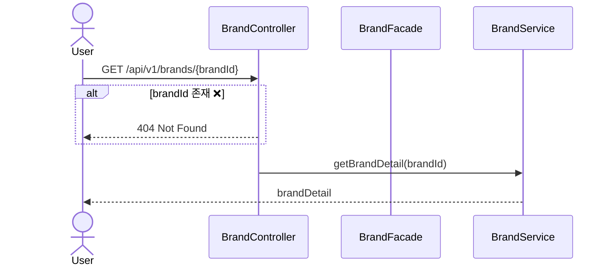
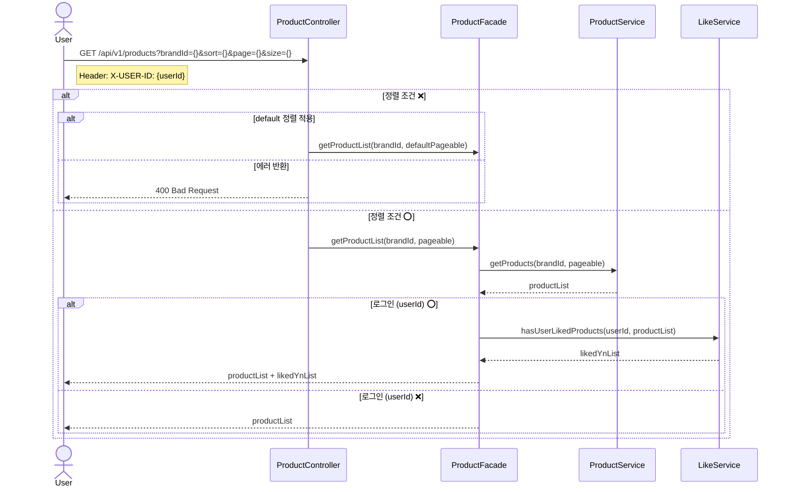
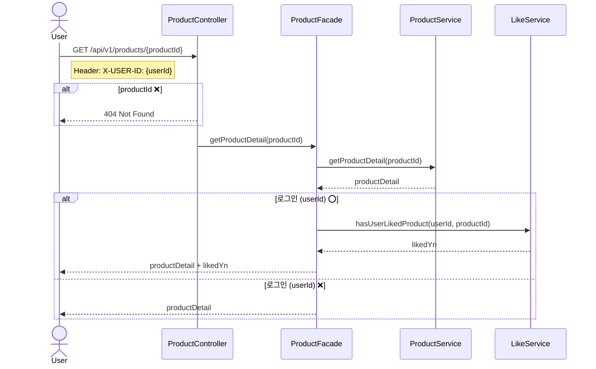
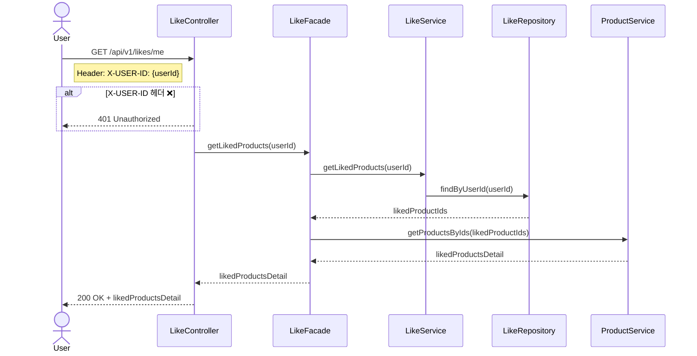
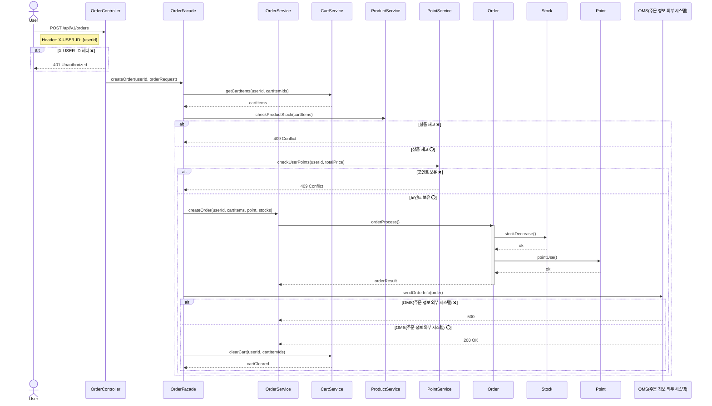
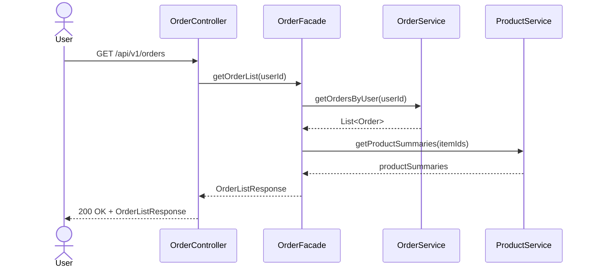
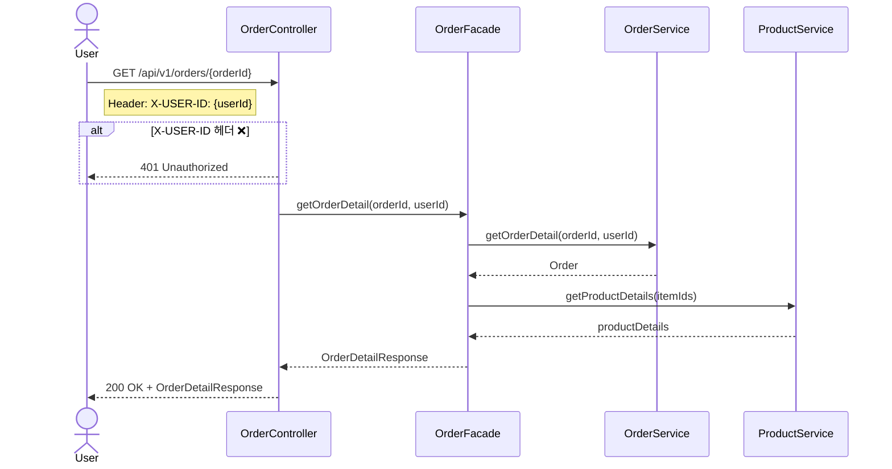
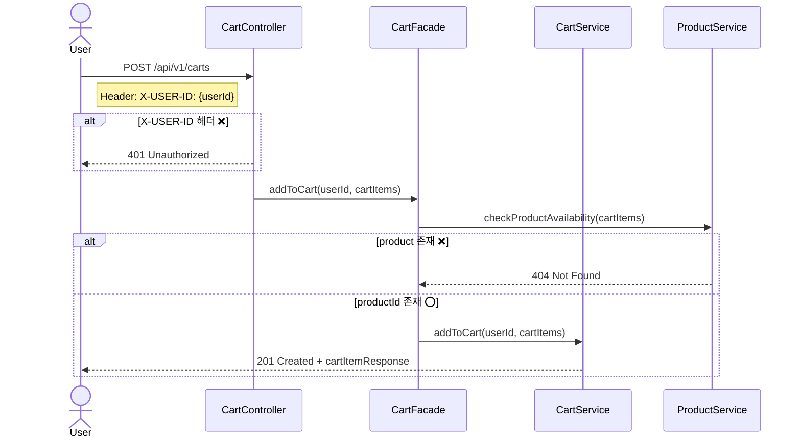
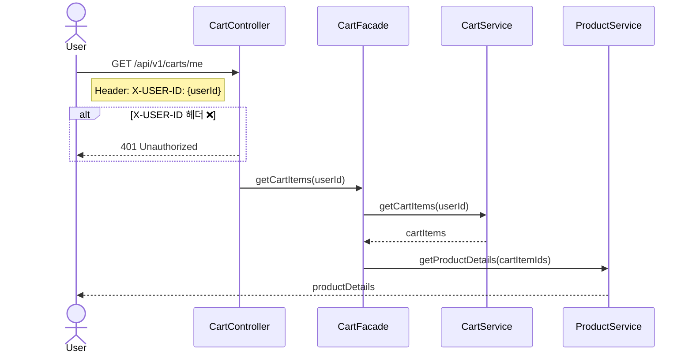

# [시퀀스 다이어그램]

## 1. 유저 (Users) <-> 브랜드 & 상품 (Brands & Products)

### ✅ 1-1. 브랜드 정보 조회

### ✅ 1-2. GET /api/v1/products 상품 목록 조회

### ✅ 1-3. GET /api/v1/products/{productId} 상품 정보 조회

---

## 2. 유저 (Users) <-> 좋아요 (Likes)

### ✅ 2-1. 좋아요 등록, 취소

### ✅ 2-2. 내가 좋아요 한 상품 목록 조회

---

## 3. 유저 (Users) <-> 주문 / 결제 (Orders)

### ✅ 3-1. 주문 요청

### ✅ 3-2. 유저의 주문 목록 조회

### ✅ 3-3. 단일 주문 상세 조회

---

## 4. 유저 (Users) <-> 장바구니 (Carts)

### ✅ 4-1. 장바구니 담기 요청

### ✅ 4-2. 내 장바구니 조회

