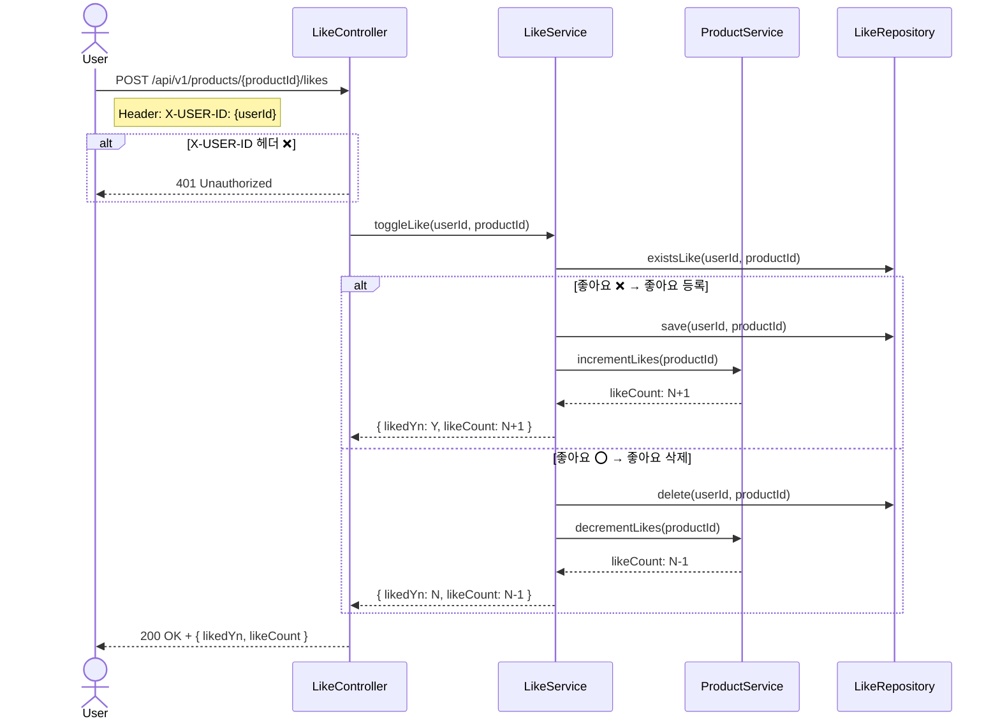
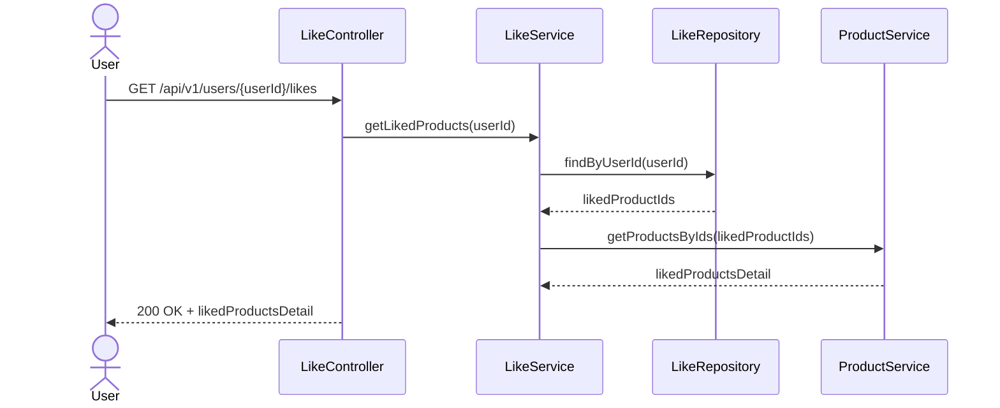

# [시퀀스 다이어그램]

## 1. 유저 (Users) <-> 브랜드 & 상품 (Brands & Products)

---

## 2. 유저 (Users) <-> 좋아요 (Likes)

### ✅ 2-1. 좋아요 등록, 취소

### ✅ 2-2. 내가 좋아요 한 상품 목록 조회

---

## 3. 유저 (Users) <-> 주문 / 결제 (Orders)

---

## 4. 상품 (Products) <-> 장바구니 (Carts)

