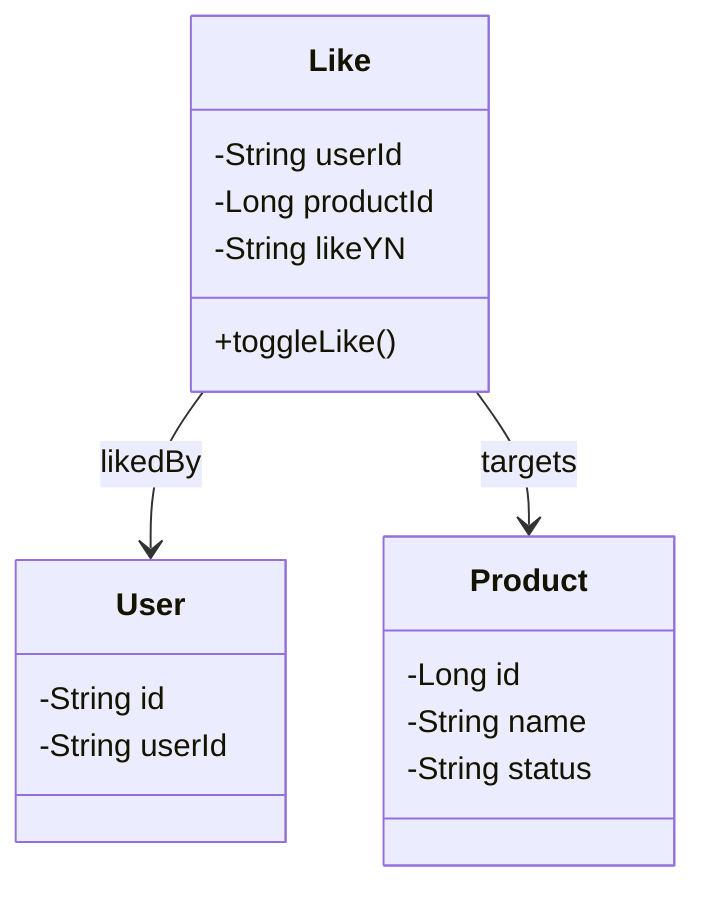

# [클래스 다이어그램]

## 1. 브랜드 & 상품 (Brands & Products)

---

## 2. 좋아요 (Likes)

```mermaid
classDiagram
    class Like {
        -String userId
        -Long productId
        -String likeYN %%{Y, N}%%
        %% 좋아요/취소 처리 메서드
        +toggleLike()
    }

    class User {
        -String id
        -String userId
    }

    class Product {
        -Long id
        -String name
        -String status
    }

    %% 관계
    %% 1명의 User → N개의 Like
    %% 1개의 Product → N개의 Like
    Like --> User: likedBy 
    Like --> Product: targets 
```

---

## 3. 주문 / 결제 (Orders)

---

## 4. 장바구니 (Carts)