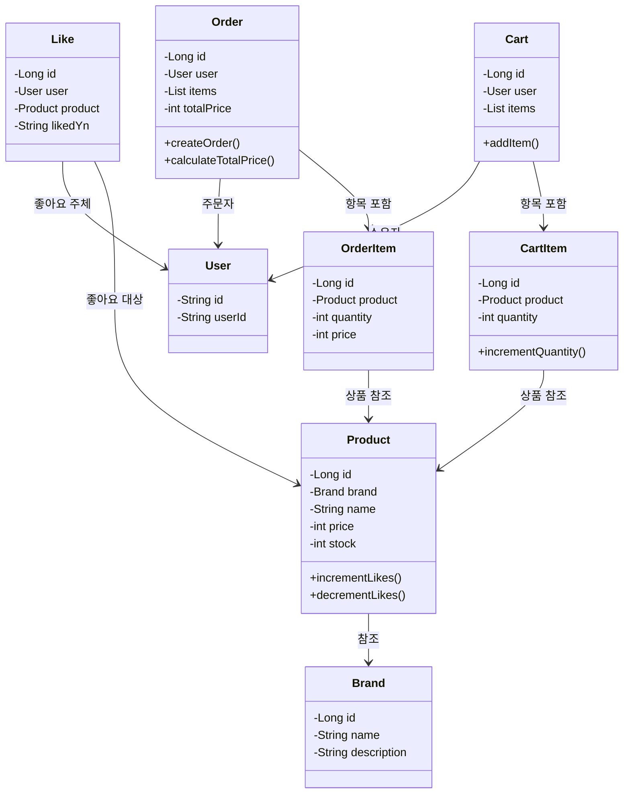
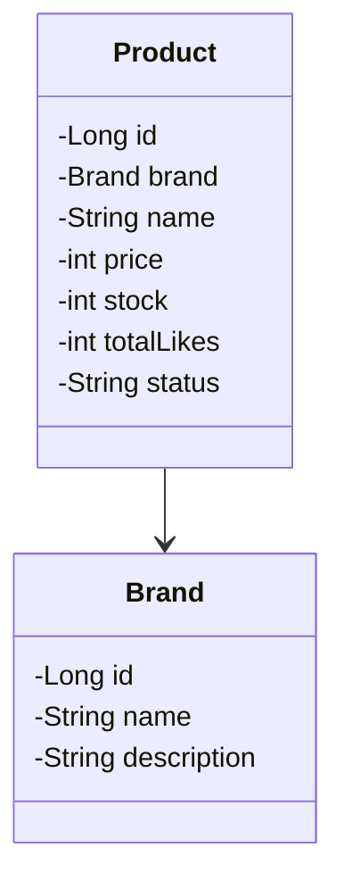
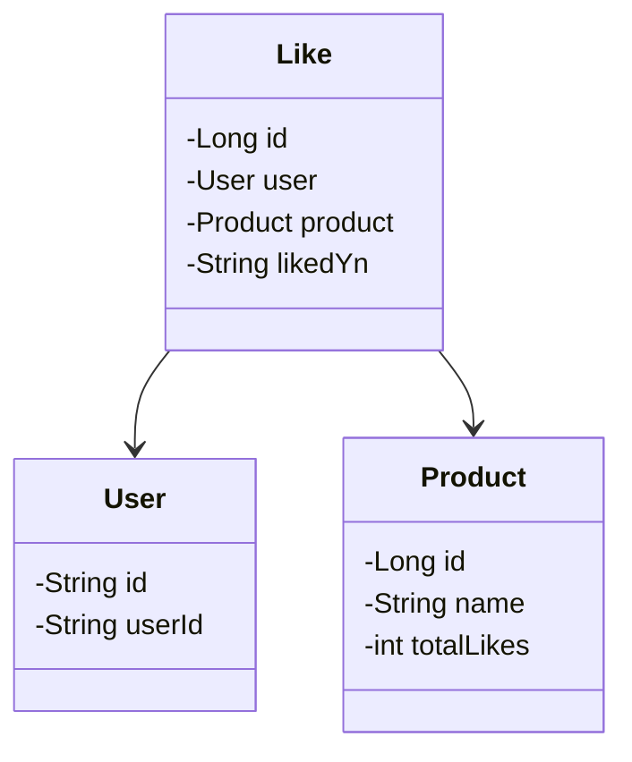
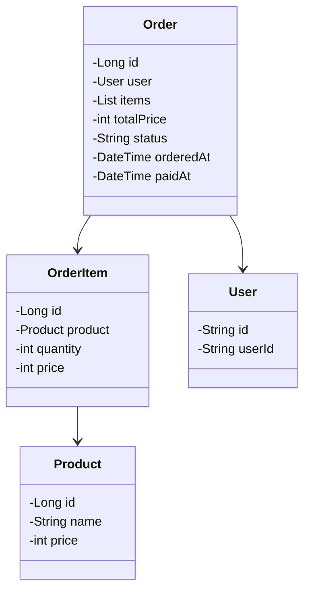
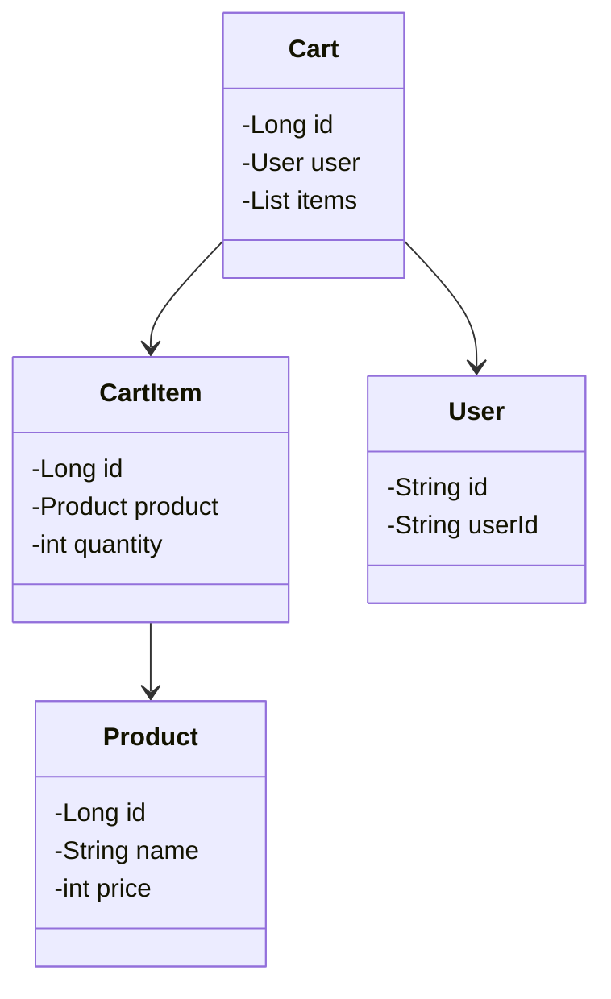

# [클래스 다이어그램]

## 1. 통합 클래스 다이어그램

```mermaid
classDiagram
    class User {
        -String id
        -String userId
    }

    class Brand {
        -Long id
        -String name
        -String description
    }

    class Product {
        -Long id
        -Brand brand
        -String name
        -int price
        -int stock
        +incrementLikes()
        +decrementLikes()
    }

    class Like {
        -Long id
        -User user
        -Product product
        -String likedYn
    }

    class Order {
        -Long id
        -User user
        -List<OrderItem> items
        -int totalPrice
        +createOrder()
        +calculateTotalPrice()
    }

    class OrderItem {
        -Long id
        -Product product
        -int quantity
        -int price
    }

    class Cart {
        -Long id
        -User user
        -List<CartItem> items
        +addItem()
    }

    class CartItem {
        -Long id
        -Product product
        -int quantity
        +incrementQuantity()
    }

    %% 관계
    Product --> Brand : 참조
    Like --> User : 좋아요 주체
    Like --> Product : 좋아요 대상
    Order --> User : 주문자
    Order --> OrderItem : 항목 포함
    OrderItem --> Product : 상품 참조
    Cart --> User : 소유자
    Cart --> CartItem : 항목 포함
    CartItem --> Product : 상품 참조
```

---

## 2. 세부 클래스 다이어그램

### 2-1. 브랜드 & 상품 (Brands & Products)

```mermaid
classDiagram
    class Product {
        -Long id
        -Brand brand
        -String name
        -int price
        -int stock
        -int totalLikes
        -String status
    }

    class Brand {
        -Long id
        -String name
        -String description
    }

    %% 관계
    Product --> Brand
```

---

### 2-2. 좋아요 (Likes)

```mermaid
classDiagram
    class Like {
        -Long id
        -User user
        -Product product
        -String likedYn
    }

    class User {
        -String id
        -String userId
    }

    class Product {
        -Long id
        -String name
        -int totalLikes
    }

    %% 관계
    Like --> User
    Like --> Product
```

---

### 2-3. 주문 / 결제 (Orders)

```mermaid
classDiagram
    class Order {
        -Long id
        -User user
        -List<OrderItem> items 
        -int totalPrice
        -String status
        -DateTime orderedAt
        -DateTime paidAt
    }

    class OrderItem {
        -Long id
        -Product product
        -int quantity
        -int price
    }

    class User {
        -String id
        -String userId
    }

    class Product {
        -Long id
        -String name
        -int price
    }

    %% 관계
    Order --> User
    Order --> OrderItem
    OrderItem --> Product
```

---

### 2-4. 장바구니 (Carts)

```mermaid
classDiagram
    class Cart {
        -Long id
        -User user
        -List<CartItem> items
    }

    class CartItem {
        -Long id
        -Product product
        -int quantity
    }

    class User {
        -String id
        -String userId
    }

    class Product {
        -Long id
        -String name
        -int price
    }

    %% 관계
    Cart --> User
    Cart --> CartItem
    CartItem --> Product
```
